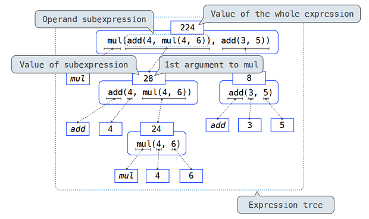

# UCB CS61A

> 参考资料：[Lecture notes / slides](https://cs61a.org/), [Textbook\(online\)](http://composingprograms.com/)

> 这门课是UC Berkeley对于SICP的演绎，与MIT，CMU都相同，选择的语言是Python，强调的重点同样是Computational thinking。

### Week 1 Functions

#### Introduction

* What is computer science - what kind of problem can be solved by computation? How to solve them, correctly and efficiently?
* What does this course do - 

1. A course about managing complexity: mastering abstraction, different programming paradim
2. Programming language: Fundamental of Python, Python projects
3. Different type of languages: Scheme and SQL

#### Expressions

* An expression **describes a computation and evaluates to a value.** All expressions can use function call notation

```python
>>> 2 + 3
>>> from operator import add
>>> add(2, 3)
```

* Name binding

```python
 area, perimeter = 3.14*r*r, 2*3.14*r # <= 同时赋值多个
 x, y = y, x # <= Python才行的任性写法
```

* Function call tree:  the evaluation procedure is _**recursive**_ in nature; that is, it includes, as one of its steps, the need to invoke the rule itself.



* Pure function: Pure functions are restricted in that they cannot have side effects or change behavior over time. 
* First, pure functions can **be composed more reliably into compound call expressions**. 

  Second, **pure functions tend to be simpler to test**. Third, Chapter 4 will illustrate that **pure functions are essential for writing** _**concurrent**_ **programs**, in which multiple call expressions may be evaluated simultaneously.

