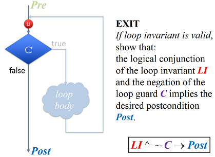
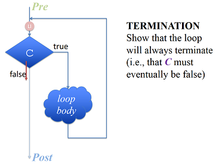
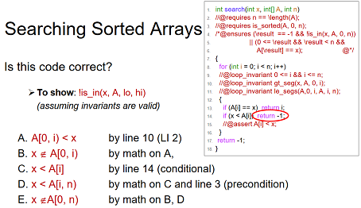
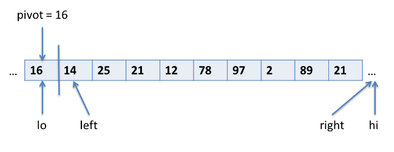
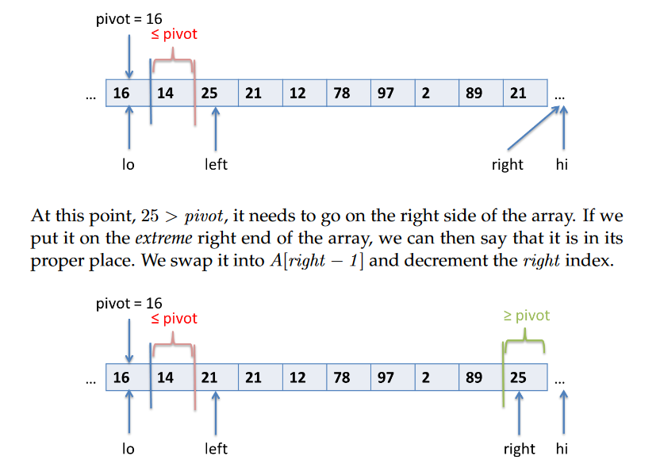
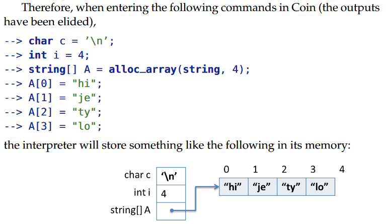
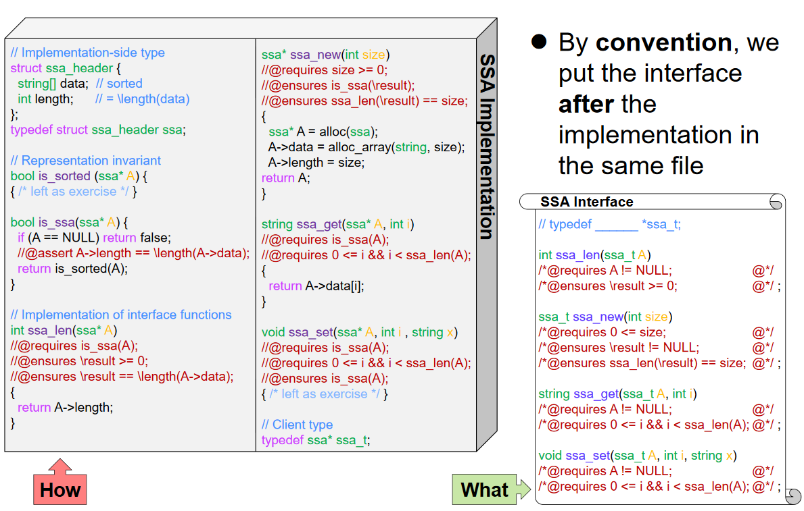

# CMU CS 15-122

> 参考资料：[Lecture Notes/Slides](https://www.cs.cmu.edu/~15122/schedule.shtml), [Homework](http://www.cs.cmu.edu/~fp/courses/15122-f15/assignments.html), [Recitation](http://www.cs.cmu.edu/~fp/courses/15122-f15/schedule.html), [C0 Language](http://c0.typesafety.net/tutorial/)
>
> 提出Design by contract / Loop invariant等概念的Bertrand Meyer的[论文](https://arxiv.org/pdf/1211.4470.pdf)
>
> UC Berkeley的CS170课程里关于loop invariant的入门[tutorial](http://www-inst.cs.berkeley.edu/~cs170/fa14/tutorials/tutorial1.pdf)
>
> TU Eindhoven的数据结构算法[课程](https://www.win.tue.nl/~kbuchin/teaching/JBP030/)

> 11.3.2019 学习上又遇到阻力，感觉在数据结构这一块的难度开始上升，不能很好地掌握invariant的写法。但是这样一直停滞也不是办法，现准备先一边复习练习目前为止的内容，然后把注意力转向Udemy的算法课，那边应该更加容易入门，掌握基本概念。

## Common contract pattern conclusion:

* 在上面Bertrand的论文中讲到，**loop-invariant不光是一个在loop中不变的量，loop invariant应该是一个Postcondition的推广形式**（postcondition是loop invariant在循环终结的瞬间的一个表现），所以可以说loop-invariant是循环体的本质。这样就很明显地告诉了我们，比如在循环中用到的一些常数量，它们虽然也都不变，但是并非我们证明程序正确性所需要的invariant。
* 核心的loop-invariant如上所述，必须在循环中保持true，且**在退出循环时，和Loop条件的否共同构成最终我们需要的结果**；除此之外，也允许或者说需要一些**附加的loop invariant，这些不具有推出结果的作用，但是可以用来确保loop成立的必要pre-condition**
* Typical unsafe operations: divide by zero, access an array element out of bound
* Access array element:

```c
//@requires i>=0 && i<\length(A);A[i]
```

* Allocate an array:

```c
alloc_array(type, n)
//@requires n >= 0;
//@ensures \length(\result) == n;
```

* Create an array based on a existing array:

```c
int[] copy_array(int[] src, int len)
//@requires len>=0;
//@requires \length(\result)==len;
```

* Routine for **traversing an array** 

```c
int[] cube (int n)
//@requires n>=0;
//@requires \length(\result)==n;
{  
  int[] A = alloc_array(int, n);
      for (int i = 0; i < n; i++)  
      //@loop_invariant i>=0;  
      {    
        A[i] = i*i*i;  
        }    
        return A;
}
```

* Typical contract for search algorithm:

```c
int search(int[] A, int x, int n)
//@requires n==\length(A);
//@requires is_sorted(A,0,n);
/*@ensures (\result == -1 && x !is_in(x,A,0,n) 
||(\result >= 0 && \result < n && A[\result] == x;@*/
{
}
```

## Lecture 0 C0 language intro

#### Environment setup

1.Download C0 compiler and config PATH.

```bash
export PATH=$PATH:$Path_to_cc0_bin
```

2.Try both Vim and Emacs to edit a simple file. Type in simple statements and save.

3.Compile your c0 file and run. **"-d" flag means dynamic check** and will check **all function contracts start with //@.**

```bash
cc0 -d factorial.c0./a.out
```

4.Or, you can run your code in the interpreter **coin**.

```bash
$ coin -d factorial.c0$ C0 interpreter (coin)Type ‘#help’ for help or ‘#quit’ to exit.--> factorial(2);--> factorial(3);
```

> On my W530, installed C0 compiler at /opt/C0/cc0/bin; PATH added in .bashrc.

## Lecture 1 Contracts

> Contracts will play a central role in this class, since they represent the key to connect algorithmic ideas to imperative programs.

```c
// A mysterious function
int f(int x, int y)
{  
  int r = 1;  
  while (y > 1) {    
  if (y % 2 == 1) {      
  r = x * r;    
  }    
  x = x * x;    
  y = y / 2;  
  }  
  return r * x;
}
```

* First try out the function.Seems it returns x^y, but doesn't make sure y is positive. We should make sure y&gt;0. To implement a precondition in C0:
* To invoke coin with **contract enabled,** use $ coin **-d** mystery.c0.
* Post condition ensures that the function return the correct result, POW\(x,y\)

```c
int f(int x, int y)
//@requires y >= 0;                 <= This is how preconditon is implemented.
//@ensures \result == POW(x,y);     <= This is how post condition is implemented.{...}
```

* //@requires + //@ensures =&gt; **safe and correct** function =&gt; contract of a function.
* In order to understand the loop, we introduce **loop\_invariant. Loop invariant abstracts the behavior of a loop.**
* By hand calculating the loop, we discovered that x ^ y is constant through the loop. Proof

$$
x' = x\cdot x, y' =y/2 \\
x' ^{y'} = (x\cdot x)^{y/2} =x^y
$$

```c
int f(int x, int y)
//@requires y>=0;
//@ensures \result==POW(x,y);{...while (e>1)
//@loop_invariant POW(b,e)*r;{...}return r*b;}
```

* Lastly, we have //@assert e==0; after the loop.
* There are only four directives in C0: //@requires, //@ensures, //@loop\_invariant, //@assert.

#### Conclusion

* We need to make sure a function is safe\(pre-condition\) and correct\(post condition\).
* Learned to use //@requires, //@ensures, //@loop\_invariant, //@assert
* 注意loop\_invariant判断的timing，是在loop guard之前，loop循环之后。
* 总结起来，这一课就是教了**一种系统的，确认function功能正确的理论方法**，和工具，以及如何分析function正确性的推理过程。比如如何确认循环的初始条件，如何推理退出循环时的数值，如何证明结果是正确的。
* 证明loop invariant**有效性\(validity\)**的一般流程:


1. 证明loop\_invariant在初始的时候是被保证的
2. 证明在任意循环步结束后，再过一次循环体，loop\_variant同样保持正确

* 证明程序**正确性\(correctnes\)**的流程：



在loop\_invariant被保证的情况下，证明组合loop invariant和loop guard的否，可以导出post条件

* 证明循环一定会结束\(termination\)：这个一般不需要太过详细的证明



* 总结：证明程序的正确性主要有几大步骤：**证明loop invariant有效，证明循环会终止，以及证明程序最后符合post condition**


* C0语言的gotcha : 1. 没有break语句来脱出循环; 2. print\(\)在收到换行符号之前不会显示到屏幕，需要用println\(\); 

## Lecture 2 Integer 

* Binary representation of integers, two's complement

```text
$ coin -l util
--> 0xAB;
171 (int)
--> int2hex(171);
"000000AB" (string)
```

* Modular arithmetic : same law as normal arithmetic!
* Two's complement representation for negative numbers
* Safety requirement for x/y and x%y:

```text
//@requires y!=0;
//@requires !(x == int_min() && y == -1); 
```

* Example : use a integer to represent color \(32bit, 8bit alpha, 8bit red, 8bit green, 8bit blue\)
* Bitwise operators : &, \|, ~, ^, &lt;&lt;, &gt;&gt;

```text
// Example, return the opacity of color P
int opacify(int p) 
{return}
```

* Rule of bit shifting:
* shifts x by k bits to the right o **k rightmost bits are dropped**
* **k leftmost bits are a copy of the leftmost bit** =&gt; sign extension
* Shifting operator safety : **//@requires 0 &lt;= k && k &lt; 32;**
* Conclusion: 这一课主要就是整数的2进制表示，在c0也并没有长短以及符号，只要考虑32位有符号数即可。关于安全性，这一课的知识点就是**位移运算不能移动负数位，或者大于31位**。
* 整数的位级运算有四种：and \(&\) or \(\|\) xor\(^\) 和 not \(~\)，以及位移 &gt;&gt;, &lt;&lt;
* 
## Lecture 3 Array

* Using array. Notation in C0 is similar with Java.

```text
% coin-->int[] A = alloc_array(int, 10);A is 0xECE2FFF0 (int[] with 10 elements)
```

* C0 memory model : **local memory** \(only for small type\), **allocated memory** \(for big data, for example, array\); pointers \(addresses of data\) can be stored in local.
* alloc\_arrary\(t, n\) : allocate memory for n type t variables. **Precondition: n&gt;=0, post condition, length of the array == n.**
* A\[i\] : access element of the array. **Precondition: 0&lt;= i &lt; n.**

```c
int[] X = alloc_array(int, 40);// Contracts for array operations://alloc_array(t,n)//@requires n>=0;//@ensures \length(result)==n;X[0] = 1;// Contracts for accessing://@requires 0<=i && i < \length(X); <= \length也是一个contract特殊指令int[] Y = X; // Y now also point to the same memory.Y==X; // <= true
```

* Task : to write a function, which can **deep copy** an array.

```c
// First attemptint[] array_copy(int[] A){  return A;}int main(){  int[] X = alloc_array(int,10);  int[] Y = array_copy(X);}// Y now become an alias of X, not deep copy.
```

```c
// Second attemptint[] array_copy(int[] A, int n)//@requires n==\length(A); //<=呼叫程序的时候，长度n应该与A相同否则含义不明{  int[] B = alloc_array(int, n);  for (int i = 0; i<n; i++)  //@loop_invariant 0 <= i;  {    B[i] = A[i];  }  return B;}
```

* 第一种尝试就是直接把源数组的地址返回出来，这显然不是复制；第二种则是在函数中新建立一个数组，复制好内容以后返回，这里需要小心的是，新建数组的大小是多少，需要强制用户输入一个和源数组一样的数字，否则就是违反安全性
* Using For-Loops to Traverse Array:

```text
--> for(int i = 0; i < 10; i++)... A[i] = i*i*i;--> A[6];216 (int)
```

* How to prove loop safety? \(Accessing A\[i\] and B\[i\]\)

```text
//@loop_invariant 0 <= i;// i<n is secured by the loop guard.
```

* Practice : Exercise 1. Write a function array  _part that creates a copy of a part of a given array, namely the elements from position i to position j . Your function should have prototype int \[\] array_  part\( int \[\] A, int i, int j\);

```c
#use <conio>#use <string>int[] array_part(int[] A, int i, int j)//@requires i>=0 && j>=i;//@requires j<\length(A);//@ensures \length(\result)==j-i+1;{  int[] B = alloc_array(int, j-i+1);  for (int m=0; m<j-i+1; m++)  //loop_invariant m>=0;  //loop_invariant m+i>=0 && m+i<\length(A);  {    B[m] = A[m+i];  }  return B;}
```

## Lecture 4 Linear search

* Search a number in a sorted array; first attempt:

```c
int search(int x, int[] A, int n){  for(int i = 0; i < n; i++){    if(A[i] == x) return i;  }  return -1;}
```

## Lecture 5 Big-O notation, Selection sort

#### Big-O analysis on linear search \( on unsorted array, sorted array -&gt; both O\(n\)\)

* Last time developed a linear search function, how much time does that cost?
* Big-O notation : big-O is a upper bound for the run-time of a function. Also, this means we only look at the highest order of a function, and ignore constants
* 再次强调Big-O是upper bound的概念，也就是说少于一个量级的，都可以称作属于O（这个量级），参考下面这个集合算式：

$$
O(1) \subseteq O(log(n)) \subseteq O(nlog(n)) \subseteq O(n) \subseteq O(n^2) \subseteq O(2^n) \subseteq O(n!)
$$

* Worst case analysis: How many steps executed in linear search?

```c
int linear_search (int[] A, int x, int lo, int hi){  for (int i = lo; i < hi; i++){    if (A[i] == x) return i;  }  return -1;}
```

* 仔细分析可以得出，i&lt;hi, i++, A\[i\]==x这些语句是每个元素都会执行一次，而最坏情况下，一共寻找n个元素，再算上i=0, return这些语句，**总共是3n+3个运算步**。根据Big-O的定义，这**既可以叫O\(n\)，也可以叫O\(n^2\)，甚至O\(n!\)**，但是一般我们希望最简洁，**最接近真实的Big-o**，所以说这是一个O\(n\)的复杂度。
* **Big-O formal definition: O\(g\(n\)\) = { f\(n\): there exist n0 in N and real c &gt;0 such that f\(n\) ≤ cg\(n\) , for all n ≥ n0 }**。**理解1**：存在某个n0，也就是说只考虑足够大的情况，在小数情况下大小并没有关系；**理解2**：存在常数C，结果也就是告诉你忽略常数系数，常数系数大小都不影响Big-O。
* Can we improve linear search?
* * For unsorted array, no.
  * For sorted array, there is chance to reduce steps. But analysis on linear search on a sorted array -&gt; Still O\(n\) because of worst case.

#### Sorting \(Selection sort\)

* A linear search on sorted array:

```c
int search(int[] A, int x, int n)//@requires n==\length(A);//@requires is_sorted(A,0,n);    // <= 这里是添加的确保A已排序条件/*@ensures (\result==-1 && is_in(x,A,0,n)) ||            \result>=0 && \result<n && A[\result]==x;@*/{  for(int i = 0; i < n; i++)  //@loop_invariant i>=0 && i<n;  //@loop_invariant !is_in(x,A,0,i);  {    if (A[i]==x) return i;    if (x<A[i]) return -1;        // <= 这个提前退出增加后，程序还正确吗？    //@assert A[i]<x;             // <= 这里利用sorted特性告诉程序提前退出  }  return -1;}
```

* 证明提前退出条件增加后程序是正确的：




* Selection sort是最简单的一种排序方法，大致步骤是从序列中先线性搜索，找出一个最小值将其排到第一位，然后从第2个元素开始再找最小，再排到第2位这样一直到结束。整个过程需要的步数是：

$$
Total = n+(n-1)+(n-2)+...+2+1=\frac{n(n+1)}{2}\subseteq O(n^2)
$$

* 为实现Selection sort需要两个帮助函数，一个是find\_min用来返回一段数组中的最小数，另一个是swap，用来把找到的最小元素排到数组头上去。find\_min是一个需要循环的函数，然后selection sort本身也需要循环调用find\_min，这里就需要证明这两个循环是安全且正确的。

## Lecture 6 Binary search

* Can do significantly better than linear search, but **requires the array is sorted**.

```c
int search(int[] A, int x, int n)//@requires n==\length(A);//@requires is_sorted(A,0,n);/*@ensures (\result == -1 && x !is_in(x,A,0,n) ||(\result >= 0 && \result < n && A[\result] == x;@*/{}
```

* The contract is similar to linear search. We start from two variables, lo and hi, keeping track of the search region. At inital step, lo = 0 and hi = n.
* Binary search的核心loop invariant是，**保证每次循环过后，在lo以下和hi以上都不存在想要找的对象**，这样在loop终止时，我们就可以保证，找到对象，或者断言对象不在数组中。

## Lecture 7 Quicksort

* Quick sort是divide and conquer思维的排序方法的典型，其过程大致如下：
* * 在数组中随机寻找一个数作为pivot，将数组中比其大和比其小的数分开\(partition\)
  * 对一个有n个数字的数组做partition，需要O\(n\)的时间，因为你需要遍历每一个元素
  * 以此类推，在两个分区里继续寻找一个pivot做分组，所需要的总时间还是O\(n\)
  * 直到所有的分区只剩下一个元素，事情就完成了。这样一共需要log\(n\)层p步骤
  * 所以一共需要 O\(nlog\(n\)\)的时间。但是，这是pivot理想的情况下，如果pivot每次都很偏离中心，那么最差情况quicksort可能会达到 O\(n^2\)的复杂度。
* 所以整个quicksort算法的核心就是一个partition函数的递归调用了。这个函数接收一个任意的pivot，返回其在排序好的数组中应有的下标，并且将前半部分和后半部分都排序好：

```c
int partition(int[] A, int pi, int lo, int hi){ ...;}void quicksort(int[] A, int lo, int hi){  if (hi - lo <= 1) return;  int pi = (hi + lo) / 2;  int mid = partition(A, pi, lo, hi);  quicksort(A, mid, hi);  quicksort(A, lo, mid);  return;}
```

* 学习到这里的时候感觉CMU那些材料有点晦涩难懂了，回家以后看了一些Youtube视频和课外书籍大致掌握了Quicksort的思路，晚上自己先写出了一个C0的quicksort实现，准备回过来再看CMU的课程资料。希望这样的学习方法是有效的，不要放弃捏~
* 讲义中提到重要概念：The quicksort function represents an example of recursion : a function \( sort \) calls itself on a smaller argument. When we analyze such a function call, **it would be a mistake to try to analyze the function that we call recursively**. Instead, **we reason about it using contracts**
* **这里提到的partition方法，首先是随机选择一个pivot，将其swap到最左边。然后用到左右两个index变量，同时向中间靠拢，直到left=right为止。**





* 最后left=right的时候，**left-1是保证小于pivot的**，所以需要swap一下left-1和pivot，这样分区就完成了


* Stability的问题：如果对于相同的元素，原先的顺序在排序后得到保留的，叫做stable，否则就是不stable。Quicksort属于后者，会改变顺序。


* 由此引出最后一个算法，mergesort。mergesort是安定，且O\( nlogn\)的算法，与Quicksort不同的是不能in-place排序，而需要另外安排空间。

## Lecture 8 Data structure

#### struct概念

* Array在内存就是一段连续存储的数据，而Array变量本身里存储的是这段连续数据的地址：



* 从array引申出struct结构，struct也是一种复合的数据结构。由于struct和array一样，不同于primitive类型，其容量可以非常庞大，因此**C0中直接禁止了直接创造struct变量**，而只能创造**指向struct的指针**。**alloc函数和alloc\_array一样，返回的是一个指针**。同时也说明，structs只能存在于heap中，不能在stack中直接创造

```c
struct img_header{  int width;  int height;  int[] data;}struct img_header IMG; // <= Errorstruct img_header* IMG = alloc(struct img_header); // <= alloc分配内存// 或者为了方便使用可以这样定义typedef struct img_header image;image* IMG = alloc(image);
```

#### Pointers

* 指针可以用来访问allocated内存中的任何数据，比如也可以在内存中开辟一个int变量，然后用指针访问：

```text
-->int* ptr1 = alloc(int);ptr1 is 0xFFAFC120 (int*)-->*ptr1 = 16;*(ptr1) is 16 (int)-->*ptr1;16 (int)
```

* 对指针取值操作用\*运算符，这同时适用于读和写的情况。
* 指针的内容应该是一个有效的地址，NULL是一个特殊的指针值，意味无效的地址。试图访问无效地址（\*pointer, pointer-&gt;...\)是不安全的操作，和试图访问超过长度的数组一样

> _**Whenever you dereference a pointer p , either as \* p or p-&gt;f , you must have a reason to know that p cannot be NULL .**_

* 在C0语言中，指针要么是指向由alloc分配的地址，要么是NULL，在C中还有更多不合法地址的可能性，将在后面的课中讲解。NULL是为什么会产生的呢？比如有这样一个例子：

```c
--> int** z = alloc(int*);z is 0xCD9260 (int**)--> z;0xCD9260 (int**)--> *z;NULL (int*)--> **z;Error: null pointer was accessed
```

#### Libraries

* library是计算机科学中抽象的一种典型体现，library通常包括**interface和implementation两部分**。用户只需要掌握interface中的参数类型和返回类型，并理解library所完成的任务即可，至于这些任务完成的细节，则隐藏在implementation中，且无需用户关心。
* 在C0语言中，调用系统library需要用\#use &lt;conio&gt;这样的语句。如果是用户自行编写的库，则需要与应用程序一起编译，比如：

```bash
$ cc0 -d pixels.c0 my-image-application.c0
```

#### Creating interface

* 考虑建立一个self sort数组，就是说数组中所有的元素都是自动排序的。



* 在C0里，library的基本结构如上图所示，implementation在前，后面跟interface。编译的时候，假设这个库叫做ssa.c0，需将库文件放在代码前面:

```text
$ c0 -d ssa.c0 my_application.c0
```

* 分析这个ssa\_t是什么类型的时候，我们考虑到它必须实现一块连续内存的存储且拥有自己的功能，所以它不可能是现有的数据类型，又因为需要将其pass给函数，所以需要它是一个指针

```c
// typedef ____* ssa_t;ssa_t ssa_new(int n);string get_ssa(ssa_t A, int x);void set_ssa(ssa_t A, int x, string s);
```

* ssa\_t需要d实现的功能主要有三个，创建新个体，插入元素和读取元素。以下将分ssa\_t的使用和ssa\_t的编写两部分展开。

