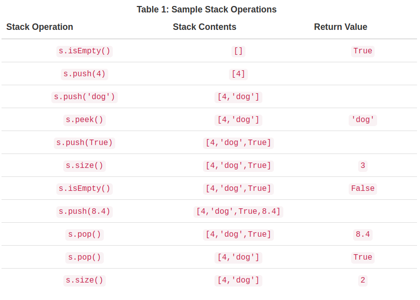

# Python Data Structure

> [**这是**](https://runestone.academy/runestone/books/published/pythonds/index.html)一本基于Python的讲解数据结构和算法的入门书。

### Ch1. Introduction

#### 背景

* 什么是计算机科学，什么是编程

计算机科学的任务是研究如何利用计算机来计算并解决问题，而不是研究或者开发计算机本身。解决问题的方法，通常被用系统的方式总结并分析，这样的方法被称为算法。为了开发复杂而高效的算法，计算机科学中最基础的手段就是**抽象**。所谓抽象，指的是把对对象的操作和对对象的实现分离开来，达到降低操作难度的目的。

举个栗子说，汽车的内部构造是十分复杂的，但是通过工程师的设计，实际汽车暴露给驾驶员的操作界面是非常简洁的，只有油门，刹车方向盘等几个部件。正是这样，驾驶员才得以专注于驾驶技术的提高，而不需要在一边开车时一边计算汽油燃烧的速率。反过来说，如果没有这样简洁的操作，驾驶会变得非常非常复杂和困难。计算机科学也是相同的，作为开发工程师，如何组织程序，使得其容易操作，容易用来解决问题，是抽象问题的核心。

再举一个程序的简单栗子。在Python中，计算平方根可以这样：

```python
root = sqrt(2)
```

sqrt\(\)这个函数就是一种过程抽象，用户无需知道如何计算一个数字的平方根就可以使用此函数。

所谓编程，就是把算法用程序语言表达出来的过程。所有的程序语言都有一些共同的元素，比如基本的数据类型，整数，小数，字符，布尔值等等。同时还有控制结构，用来实现程序流程的分支，循环等等。然而，很多算法的过程是非常复杂，光有这些基本的元素使得实现算法有时候过于繁复。于是我们就有了抽象数据结构\(Abstract data type, ADT\)。

* 什么是抽象数据结构，为什么要研究数据结构

抽象数据结构就是组合基本的数据类型，并赋予它们一些特定的操作接口，来模拟一些更为复杂的数据形式。比如说，我们在Python中已经有了整数这个基础数据类型，但是并没有矢量这种类型。为了实现矢量的乘法，我们需要这样：

```python
vectorA_x = 1
vectorA_y = -1
vectorB_x = -1
vectorB_y = 1
A_multi_B = vectorA_x * vectorB_x + vectorA_y * vectorB_y
```

而我们期待可以实现这样的写法：

```python
# 以下是意淫，实际是不能这样操作的
vectorA = (1,1)
vectorB = (-1,1)
vectorA * vectorB # => 0
```

比较上面两种实现方法，前者不仅多了几行，更要命的是**由于不能重复使用**，每次建立新的矢量都需要反复定义反复手动计算，将使得计算程序变得非常冗长。这就是建立新的数据结构的必要性一种体现。

矢量是在物理或者工程中为了表现物理量，解决物理问题所抽象出来的一种数据结构。在计算机科学领域，也有很多具有共性的问题被总结分析研究得非常透彻，这些问题大多数可以被归类为**数值计算问题**和**非数值计算问题**。数值计算算法主要研究对象就是矩阵运算，因此不需要过多的抽象数据结构。相对的非数值计算问题，则有必要建立不同的模型来表现问题。这些问题包括**排序，查找，优化**等等。为了解决这些问题，相应的开发出了很多合适的数据结构，比如**链表，队列，堆栈，哈希表**等等。

* 为何要研究算法

为了解决具有共性的特定的一类问题，人们总结出了各种的算法。不仅如此，解决同一类问题，也有很多不同的算法，这些**算法的速度，效率，复杂程度各不相同**。有的易于实现，但速度奇慢，有的过程复杂，但是效率较高，这样的局面就需要我们**研究并理解各种算法的特点**，针对各种问题，使用最合理的算法。

#### Python语言佛脚

* Python中的基础变量类型：int, float, boolean
* 派生数据类型：list

```python
>>> myList = [1,2,3,True]
>>> myList = [0] * 6
>>> myList + otherList
```

* range\(\)是一个常用的生成list的工具，range生成的数列包括头而不包括尾

```python
>>> list(range(0,5))[0,1,2,3,4]
>>> list(range(5,10,2))[5,7,9]
```

* String就是字符的list，很多操作方法都和list类似
* String和list不同的是，String是不可修改的，一旦赋值，不能再用赋值语句修改其中的字符
* 另外还有Tuple，也是不可修改版本的list
* 最后就是dict型，同时包括keys和values，items则表示键值对。

```python
>>> phonenumb = {'david' : 1410, 'sarah' : 1137}
>>> phonenumb.keys()dict_keys(['david','sarah'])
```

* I/O : print\(\)和input\(\)这两个基本函数。另外print存在格式输出的方法

```python
print(aName, "is", age, "years old.")
print("%s is %d years old." % (aName, age))
# 以下是c语言中的输入输出写法
printf("Area = %d.\n", area);
scanf("Enter your r here : %d.\n",&r);
```

* 控制结构\(if-else\)语句，循环\(for ... in list\)语句不再赘述。仅提一个生成list时用的技巧list comprehension:

```python
>>> square = [x*x for x in range(10)]
>>> sqlist = [x*x for x in range(1,11) if x%2 != 0]
```

* 例外的处理。在程序运行过程中产生的run-time错误成为例外。在Python中可以事先在代码中准备好对例外的处理：

```python
>>> try:
...   print(math.sqrt(-7))
... except:   # <= 这里并不一定要指定error类型...   
print("Bad Value for square root")
>>> Bad Value for square root
```

* 函数的定义: def语句，不再赘述。

#### OOP数据结构编程实例

至此我们对于数据结构和Python语言都有了概括性的了解，现在是时候结合Python的面向对象语言特征来实例说明一下构建数据结构的过程和方法。

#### 1. 分数数据模型

试想我们想建立一个可以表现分数的数据类型。Python固然已经有了小数类型在本质上和分数具有同样的功能，但是假设我们想要像分数一样实际操作数据的分数，分母，且让分数加减乘除运算式实际返回约分好的分数，这个时候就有必要建立一个新的数据类型。

```python
# 建立新的类时用class关键字
# __init__是特殊的构造函数，每次类被实例化时被呼叫
# self是__init__函数必须要有的参数，因为观察下面的属性赋值语句左边，
# 不可避免地要用到self
class Fraction:    
    def __init__(self,top,bottom):        
        self.num = top        
        self.den = bottom
myfraction = Fraction(3,5)  # <= 3/5
```

接下来我们从最简单的打印表示开始考虑Fraction这个类的操作接口。

```python
>>> myf = Fraction(3,5)
>>> print(myf)
<__main__.Fraction instance at 0x409b1acc>
```

以上的代码说明，Python不知道如何来打印Fraction这个类的对象，因为我们并没有给出任何的打印方式，所以只能返回对象的地址。解决这个问题的第一招是自己来定义一个show方法：

```python
def show(self):     
    print(self.num,"/",self.den)
```

但是这样并不能达到让Python的print语句认识Fraction对象的目的。

```python
...def __str__(self):    
    return str(self.num)+"/"+str(self.den) 
>>> myf = Fraction(3,5)
>>> print(myf)
3/5
>>> print("I ate", myf, "of the pizza")
I ate 3/5 of the pizza
>>> myf.__str__()
'3/5'   
```

\_\_str\_\_这个特殊函数在没有定义时，会自动返回对象的地址。现在我们按照上面的写法override之后，就可以正常打印分数了。

接下来我们考虑如何实现分数的加法。现在如果我们不顾一切强行让Python加起两个分数：

```python
>>> f1 = Fraction(1,4)
>>> f2 = Fraction(1,2)
>>> f1+f2
Traceback (most recent call last):  File "<pyshell#173>", line 1, in -toplevel-    f1+f2TypeError: unsupported operand type(s) for +:          'instance' and 'instance'
```

这个错误告诉我们，类似于print的问题，Python并不知道如何相加两个Fraction的对象。我们的解决方案也和前面类似，overide \_\_add\_\_这个方法：

```python
def __add__(self,otherfraction):     
    newnum = self.num*otherfraction.den + self.den*otherfraction.num  
    newden = self.den * otherfraction.den     
    return Fraction(newnum,newden)     
```

* 至此分数的数据模型例子就差不多了，主要讲述了
* [x] 如何建立一个新的类，类的构建方法
* [x] 如何overide类的一些原有行为，比如\_\_str\_\_方法，\_\_add\_\_方法

#### 2. 逻辑门电路模拟

* 在这个例子中将写一个类来模拟逻辑门电路的举动，主要涉及的概念是类的继承。
* 基本的逻辑门主要有两类，**binary和unary**，与门或门属于binary，而非门由于只有一个输入属于unary。在编写的层次上，计划一个基类LogicGate，下面有两个子类binary和unary，再下面各个具体的逻辑门种类。

```python
class LogicGate():    
    def __init__(self,label):       
        self.label = label
        self.output = None
    def get_label(self):        
        return self.label        
    def get_output(self):        
        self.output = self.performLogic()        
        return self.output
```

* 上面的self.performLogic\(\)方法是用来根据输入计算输出的函数，这里并不需要写入LogicGate这个基础类中，可以**等到下面具体的逻辑门里再去实现，这是非常有用的一种构造技巧**。
* 接下来就用继承的方法，从LogicGate出发写两个逻辑门的类型，需要注意的是继承的写法，以及构造方法中调用父类构造的方法。**这是一个固定的写法，每当继承父类时，子类中总是先呼叫父类的构造方法，然后接下去写自己的构造内容**

```python
class binaryGate(LogicGate):    
    def __init__(self, label):        
        LogicGate.__init__(self, label)        
        self.pinA = None        
        self.pinB = None        
    def getPinA(self):        
        return int(input("Enter pin A for gate "+self.get_label() + "->"))            
    def getPinB(self):        
        return int(input("Enter pin B for gate "+self.get_label() + "->"))

class UnaryGate(LogicGate):# 同上不再赘述
```

```python
class AndGate(BinaryGate):    
    def __init__(self,n):        
        super(AndGate,self).__init__(n)    
    def performGateLogic(self):        
        a = self.getPinA()        
        b = self.getPinB()        
        if a==1 and b==1:            
            return 1        
        else:            
            return 0            
            
>>> g1 = AndGate("G1")
>>> g1.getOutput()
Enter Pin A input for gate G1-->1
Enter Pin B input for gate G1-->0
0
```

* 最后我们有一个connector的类，有get\_from和getTo两个功能，一旦前面的门被它连接，只要呼叫它的get\_From或者getTo，就可以获取前面或者后面的门的输入输出。

```python
class Connector:    
    def __init__(self, fgate, tgate):        
        self.fromgate = fgate        
        self.togate = tgate        
        tgate.setNextPin(self)    
    def getFrom(self):        
        return self.fromgate    
    def getTo(self):        
        return self.togate
```

### Ch2. A proper class

这章看起来是要介绍一些关于写Class的技巧，但是2019年目前还没有更新完成。。

### Ch3. Analysis

接下来当然是老生常谈的算法分析问题了。

* 为什么要分析算法？为了定量比较不同算法的好坏。程序的好坏有很多指标，比如易读性，速度，空间占用等。这里我们先考虑的是执行时间。比如说有一个求N项和的函数sumofN2\(n\):

```python
import time
def sumOfN2(n):   
    start = time.time()   
    theSum = 0   
    for i in range(1,n+1):      
        theSum = theSum + i   
    end = time.time()   
    return theSum,end-start
```

我们在命令行中将其执行10000次：

```python
>>>for i in range(5):       
print("Sum is %d required %10.7f seconds"%sumOfN(10000))
Sum is 50005000 required  0.0018950 seconds
```

再试试将其执行100000次：

```python
>>>for i in range(5):       
print("Sum is %d required %10.7f seconds"%sumOfN(100000))
Sum is 5000050000 required  0.0199420 seconds
```

可以看到执行时间增长了10倍！现在假设我们有一个不同的函数，用求和公式求和：

```python
def sumOfN3(n):   
    return (n*(n+1))/2print(sumOfN3(10))
```

对这个程序进行测量的结果当然是：

```python
Sum is 50005000 required 0.00000095 seconds
Sum is 5000050000 required 0.00000191 seconds
Sum is 500000500000 required 0.00000095 seconds
Sum is 50000005000000 required 0.00000095 seconds
Sum is 5000000050000000 required 0.00000119 seconds
```

无论你执行多少次，花费的时间都是类似的。以上这些直接benchmark的方法固然给了我们对于程序性能的一定理解，但是这些计测都是依赖于特定的硬件环境，一旦硬件不同，结果也会相应改变，从而使得比较程序变得困难。因此这里开始引出big-O表示法的概念。

#### 一些简单的测量实验

* 首先我们了解一些用Python来计测时间的简单方法：
* * 用time\(\)函数计测开始及结束时间（最简单直观，但是受到的影响较多）

```python
import time
start = time.time()
l = []
for i in range(10000):    
    l.append(i)
print(time.time() - start) # time返回的结果单位是second
```

* 使用timeit模块里的Timer类

```python
def test1():   
    ...
// Timer也是timeit里的一个类；使用时第一个参数是执行语句，第二个是setup语句
t1 = Timer("test1()", "from __main__ import test1") 
print("Test",t1.timeit(number=1000), "milliseconds")
```

* 在命令行用timeit模块

```bash
$ python -m timeit -s "setup" "statement"
# timeit会自动把statement跑1000000次（默认），然后给你一个usec的数值
```

* 注意到timeit模块会要求你给出setup语句，其中需要from \_\_main\_\_ import。。。这其中的原因是，**timeit会自动建立一个空白的namespace防止现有space影响其计测结果**。也是因此你需要明确指示timeit应该要import哪些模块。
* time\(\)和timeit\(\)的比较：timeit\(\)应该来说更加准确，但是准确多少呢？我准备了如下一个s小实验：

```python
import time
def test1():    
    start = time.time()    
    for i in range(1000):        
        l = [i for i in range(1000)]    
    return (time.time()-start)
print(test1())    # => 0.026647329330444336
```

```python
>>> from timeit import Timer
>>> t1 = Timer('l = [i for i in range(1000)]')
>>> t1.timeit(number = 1000)
>>> 0.027547000005142763
```

* 结论：至少就简单的实验来说，两者的差别非常小，timeit\(\)的结果可能更加均一，time\(\)会有一点波动，仅此而已

### Ch4. Basic data structures

这一章将主要介绍线性数据结构，包括stack, queue, deque, linked list。学习目标是要学会用Python自己建立这些简单数据结构，并对他们的性能特点作出实验判断。所谓线性数据结构，往往是一个有序的序列，序列有两个端。

#### Stack 堆栈

* 堆栈的特点是，**向堆栈添加或者减去数据的操作，都发生在堆栈的同一端（顶端top）**，而处于最下方不被碰到的端叫做base。堆栈的操作原则叫做LIFO \(last in first out\)


* 堆栈的特性使得反转一个列表很容易，因为最后加进去的在最上面，在base的则是最先加进去的元素
* 比如说，想象你在浏览器不断按倒退键的时候，就是类似在取用堆栈最上面元素的例子
* Stack堆栈需要支持以下这些基本的操作:



