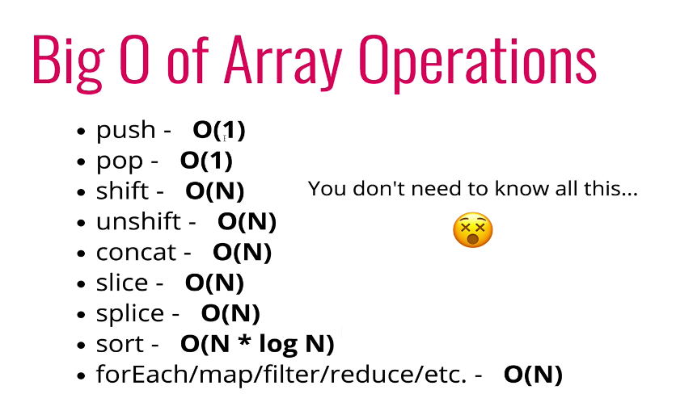

# Udemy Algorithm

## Section 1: Introduction

* Use Google Chrome's snippet console as environment

## Section 2: Big-O notation

* Comparing two add up functions:

```javascript
function addUp1(n)
{
  let s = 0;
  for (let i = 0; i <= n; i++){
    s += i;
  }
  return s;
}

function addUp2(n){
  return (n + 1) * n / 2;
}
```

* Which one is faster? We can time the code by:

```javascript
let t1 = performance.now();
addUp1(1000000000);
let t2 = performance.now();
console.log(t2-t1)
```

* But the time is different on different machine, for longer calculation it might take very long time, and the time is not accurate
* **Rather than counting seconds, let's count the number of simple operations the computer has to perform**!
* But counting is hard, sometimes you don't know the exact number or miss something. But regardless of the exact number, the number of operations roughly grow proportionally as n.
* **Big-O : how the runtime grows as the input size grows**.
* Big-O simplifying tips:
* * Constant don't matter \( O\(5n\) =&gt; O\(n\) \)
  * Smaller terms don't matter \( O\(n+10\) =&gt; O\(n\), O\(n^2 + 5n + 8\) =&gt; O\(n^2\) \)
  * Common constant runtime operation : 
  * * arithmetic operation
    * variable assignment
    * accessing elements in an array

## Section 3: Analyze performance

* Arrays; when are arrays slow? =&gt; **Access is quick \(O\(1\)\), insertion and removal is slow\(O\(n\)\); search is O\(n\) \(if the array is unsorted\)**

```javascript
let names = ["michael", "Julia", "mark"];
```

* Big-O of common array operations



## Section 4: Problem solving pattern

#### Step 1: Understand the problem 初步理解问题

* * Can you re-phrase the problem in your own words?
  * What's the input and output of the problem?
  * How can I label the important data related in this problem?
* Example : write a addition function.
* * Ask yourself: what's the input ? Integer? Floats? How large?

#### Step 2: Concrete example 通过例子来深入理解问题的要求

* Write a function that counts each characters in a word
* Start with simple solutions, explore more complex ones, invalid inputs, empty inputs....

```javascript
char_count("aaaa"); // What should this return?
{a:4} // <= A dict with keys and values

char_count("My phone number is 129391923"); // Should we count space and numb?

char_count(); // What should we return? An empty dict? Zero? A bool false?
```

#### Step 3: Break it down 写作战计划

* Explicitly write down the steps you need to take
* Start with a skeleton of your code: 假设通过上个环节的沟通，我们已经确定了不需要考虑大小写，需要count数字但是不考虑符号和空格，我们也确定了准备用dict来返回结果

```javascript
function char_count(str){
// Do something
// 1. Make an object

// 2. Loop over the string
//    - If the char is already in the object, add 1 to the value
//    - If the char is not in the object, create the key, and add 1
//    - If the char is space or sign, do nothing
// 3. Return the object
}
```

* **在实际写代码之前，这样罗列解决问题的计划非常重要。**这不仅给了你自己一个可以遵循的骨架，也让面试官看到你思维的过程。假设最后你只进行到一半没有完成，有这个骨架也会让面试官看到你整体的思路，比一片空白要好很多！

